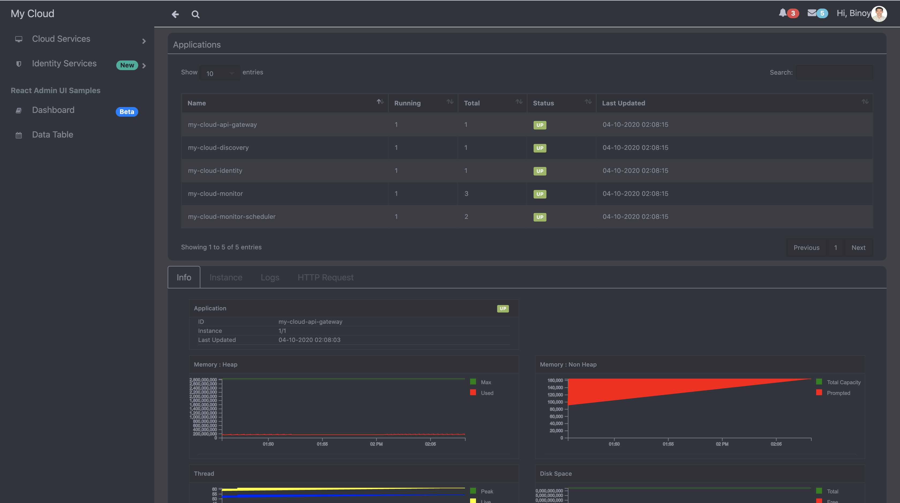

# My Cloud Service 1.0

This is one of the my dream expriement project to learn how to build my cloud platform with help of open source, its helps to run the microservice application under this platform. The experiement is which I am doing to integrate the all cloud related open services will be integrated in this platform, its provides the reactie dashboard which can view and configure the micorservice or other services and also can run this any cloud service platform.

##### My goals is in this project to learn integrate the below functionality, which

* Discovery Service
* API Gateway Configuration
* Identity Service
* Running the microservice containers
* Monitor, Configuration, Deployment with help of Dashboard

##### Currently available service are below:
* Discovery Service
* API Gateway
* Identity Service
* Montoring Service
* React Dashboard

## Technology
* Backend 
  * Spring Boot Framework 
    * Netflix Discovery Pattern 
    * Netflix Zuul API Gateway
    * Netflix Circuit Breaker
    * Netflix Loadbalancer
    * Oauth2 Server and Resource
    * Cloud Config
    * Spring Data
      * MongoDB
      * Elasticsearch 
    * Logs 
      * Logback
        * ANSI Color
        * Human Readable Format
        * Retention Policy
      * Tomcat Access Log
    * Actuator
      * JMX 
      * Jolokia
    * Oauth2 Rest Template
    * Security
      * Basic Security
      * Oauth2 
      * JWT Token
  * Other Framework
    * Jolokia
    * InfluxDB Java Client
    * Lombok
  * Maven
    * Module
    * Dependency Management
    * Dockerfile Maven Plugin
  * My Cloud Service 
    * Identity Service
    * Discovery Service
    * Config Server
    * Monitor Service
    * Monitor Scheduler Service
    * API Gateway
    * My Cloud Dashboard

* Other Service and Frameworks
  * Database
    * MongoDB
    * Influxdb
    * Elasticsearch
  * ELK
    * Filebeat
    * Elasticsearch
    * Kibana
  * Kubernetes
    * Deployment Elastic Search
    * Deployment MongoDB
    * Deployment InfluxDB
    * All My Cloud Services
      * (Not included the dashboard)
  * Docker
    * Docker Compose
    * Docker Hub
    * Docker 
      * Build
      * Volume
      * Links
  * Maven
    * Module
    * Dependency Management
    * Dockerfile Maven Plugin
  * Git Server
    
* Frontend 
  * React JS
  * Server Sent Event (Event Source)
  * D3 & Morris js chart
  * Bootstrap
  * Awesome Font
  * CSS
  * JQueries
  * HTML

#### In progress .....

## Run Commands

#### Run the docker server localy
  https://github.com/developerhelperhub/my-cloud-git-server/blob/master/README.md

  All cloud configuration files are located : /step/my-cloud-config-repo. We have to commits those all files in the git server before run this project

#### Running all the services on Docker in different terminal with below order
$ cd /setup/docker
$ docker-compose up my-cloud-git-server
$ docker-compose up my-cloud-mongodb
$ docker-compose up my-cloud-influxdb
$ docker-compose up elasticsearch
$ docker-compose up my-cloud-discovery
$ docker-compose up my-cloud-config-server
$ docker-compose up my-cloud-identity
$ docker-compose up my-cloud-api-gateway
$ docker-compose up my-cloud-monitor
$ docker-compose up my-cloud-monitor-scheduler

#### Running all the services on Minikube of Kubernetes 
Please refer the document of cd /setup/kubernetes

#### Running My Cloud Dashboard
$ cd /my-cloud-dashboard
$ npm start

#### Stop all the services
$ cd /setup
$ docker-compose down

## Screens
* Login Page

* Dashboard Page

* Discovery Dashboard Page

* Monitor Dashboard Page (Info Tab)

* Monitor Dashboard Page (Info Tab - Graph)

* Monitor Dashboard Page (Info Instance)

* Monitor Dashboard Page (Info Instance Details)

* Monitor Dashboard Page (Logs)

* Monitor Dashboard Page (Access Logs)

* Identity Client Page

* Identity User Page

