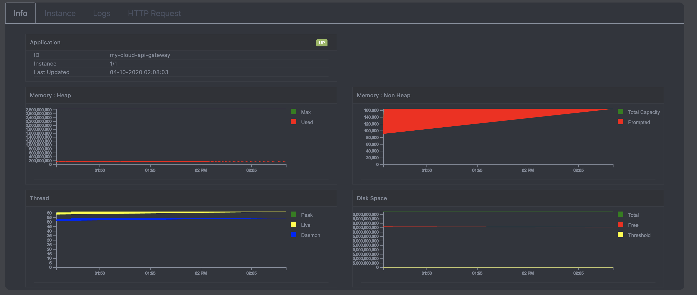
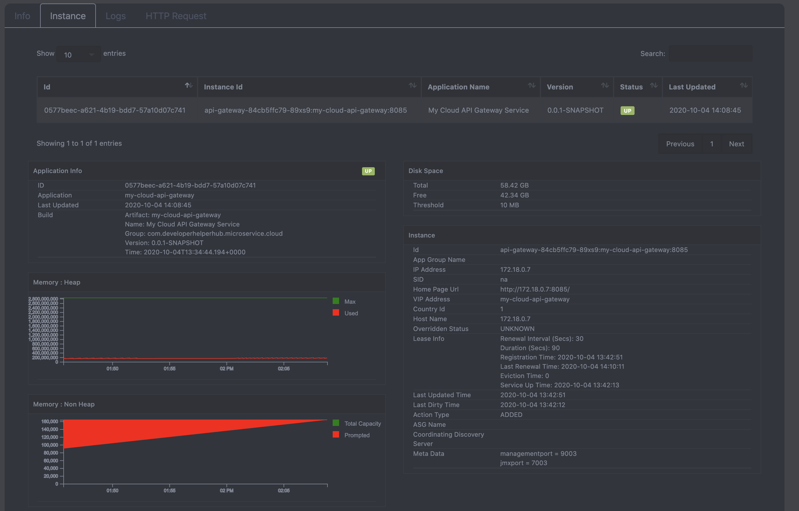
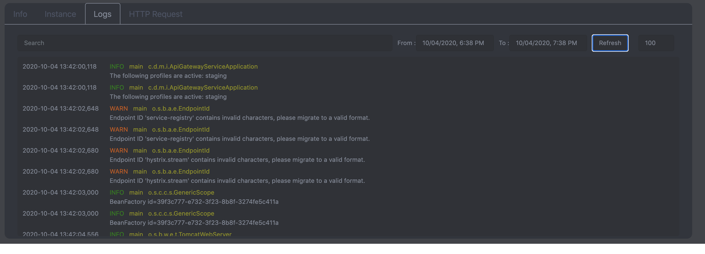

# My Cloud Service 1.0

This repostiry contains the development of the my cloud service. This project includes reactive based monitor dashboard has been implemented.

## Technology
* Backend 
  * Spring Boot Framework 
    * Netflix Discovery Pattern 
    * Netflix Zuul API Gateway
    * Netflix Circuit Breaker
    * Netflix Loadbalancer
    * Oauth2 Server and Resource
    * Cloud Config
    * Spring Data
      * MongoDB
      * Elasticsearch 
    * Logs 
      * Logback
        * ANSI Color
        * Human Readable Format
        * Retention Policy
      * Tomcat Access Log
    * Actuator
      * JMX 
      * Jolokia
    * Oauth2 Rest Template
    * Security
      * Basic Security
      * Oauth2 
      * JWT Token
  * Other Framework
    * Jolokia
    * InfluxDB Java Client
    * Lombok
  * Maven
    * Module
    * Dependency Management
    * Dockerfile Maven Plugin
  * My Cloud Service 
    * Identity Service
    * Discovery Service
    * Config Server
    * Monitor Service
    * Monitor Scheduler Service
    * API Gateway
    * My Cloud Dashboard

* Other Service and Frameworks
  * Database
    * MongoDB
    * Influxdb
    * Elasticsearch
  * ELK
    * Filebeat
    * Elasticsearch
    * Kibana
  * Kubernetes
    * Deployment Elastic Search
    * Deployment MongoDB
    * Deployment InfluxDB
    * All My Cloud Services
      * (Not included the dashboard)
  * Docker
    * Docker Compose
    * Docker Hub
    * Docker 
      * Build
      * Volume
      * Links
  * Git Server
    

* Frontend 
  * React JS
  * Server Sent Event (Event Source)
  * D3 & Morris js chart
  * Bootstrap
  * Awesome Font
  * CSS
  * JQueries
  * HTML

#### In progress .....

## Run Commands

#### Run the docker server localy
  https://github.com/developerhelperhub/my-cloud-git-server/blob/master/README.md

  All cloud configuration files are located : /step/my-cloud-config-repo. We have to commits those all files in the git server before run this project

#### Running all the services on Docker 
$ cd /setup/docker
$ docker-compose up

#### Running all the services on Minikube of Kubernetes 
Please refer the document of cd /setup/kubernetes

#### Running My Cloud Dashboard
$ cd /my-cloud-dashboard
$ npm start

#### Stop all the services
$ cd /setup
$ docker-compose down

## Screens
* Login Page

* Dashboard Page

* Discovery Dashboard Page

* Monitor Dashboard Page (Info Tab)

* Monitor Dashboard Page (Info Tab - Graph)

* Monitor Dashboard Page (Info Instance)

* Monitor Dashboard Page (Info Instance Details)

* Monitor Dashboard Page (Logs)

* Monitor Dashboard Page (Access Logs)

* Identity Client Page

* Identity User Page

