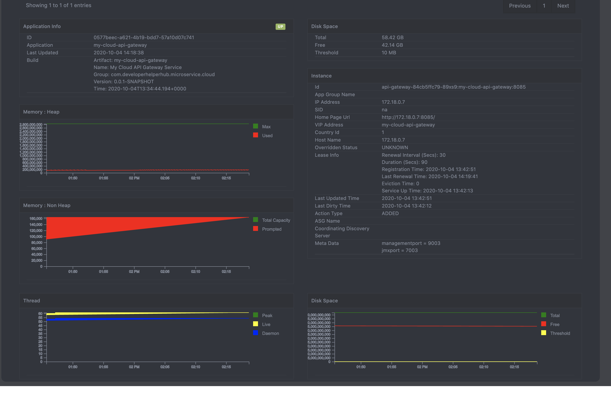

# My Cloud Service 1.0

This repostiry contains the development of the my cloud service. This project includes reactive based monitor dashboard has been implemented.

## Technology
* Backend 
  * Spring Boot Framework 
    * Netflix Discovery Pattern 
    * Netflix Zuul API Gateway
    * Netflix Circuit Breaker
    * Netflix Loadbalancer
    * Oauth2 Server and Resource
    * MongoDB Repository
    * Actuator
      * JMX 
      * Jolokia
    * JMX 
    * Oauth2 Rest Template
    * Security
      * Basic Security
      * Oauth2 
      * JWT Token
  * Other Framework
    * Jolokia
    * InfluxDB Java Client
    * Lombok
  * Database
    * MongoDB
    * Influxdb
  * Docker
    * Docker Compose
    * Docker Hub
    * Docker 
      * Build
      * Volume
      * Links
  * Maven
    * Module
    * Dependency Management
    * Dockerfile Maven Plugin
  * My Cloud Service 
    * Identity Service
    * Discovery Service
    * Monitor Service
    * Monitor Scheduler Service
    * API Gateway
    * My Cloud Dashboard
* Frontend 
  * React JS
  * Server Sent Event (Event Source)
  * D3 & Morris js chart
  * Bootstrap
  * Awesome Font
  * CSS
  * JQueries
  * HTML

#### In progress .....

## Run Commands

#### Running the services
$ cd /setup
$ docker-compose up

#### Running My Cloud Dashboard
$ cd /my-cloud-dashboard
$ npm start

## Screens
* Login Page

* Dashboard Page

* Discovery Dashboard Page

* Monitor Dashboard Page (Info Tab)

* Monitor Dashboard Page (Info Tab - Graph)

* Monitor Dashboard Page (Info Instance)

* Monitor Dashboard Page (Info Instance Details)

* Identity Client Page

* Identity User Page

* Sample React Admin UI - Dashboard Page

* Sample React Admin UI - Data Table Page

